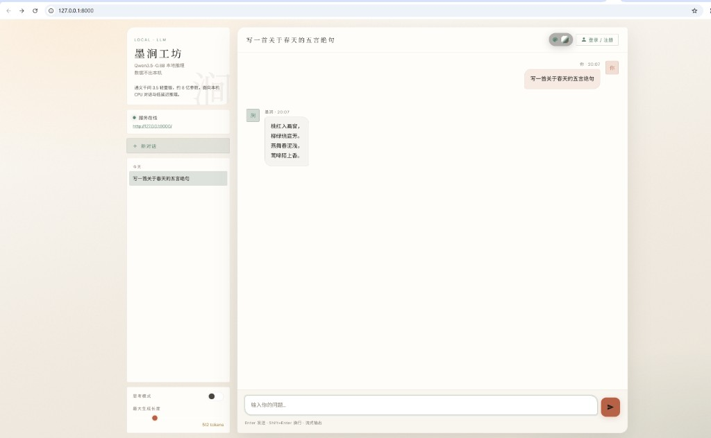

# 墨涧 · Qwen3.5-0.8B 本地对话

基于 [ModelScope](https://modelscope.cn/) 的本地大模型聊天应用。在本地运行 **Qwen3.5-0.8B**，提供 Web 对话界面与 HTTP API，无需依赖云端服务，适合个人机器离线使用。



## 功能特性

- **本地推理**：CPU 友好，默认在 CPU 上运行 0.8B 小模型
- **流式对话**：支持 SSE 流式输出与中途停止生成
- **思考模式**：可选开启 Qwen 思考链（适合复杂问题，速度较慢）
- **多会话管理**：创建、重命名、删除对话，消息持久化到 SQLite
- **用户体系**：支持游客模式与注册/登录，登录后可合并游客历史
- **分享**：单条问答可生成分享链接
- **多主题 UI**：六种可切换界面主题
- **一键启动**：自动创建虚拟环境、安装依赖、下载模型并打开浏览器

## 技术栈

| 层级 | 技术 |
|------|------|
| 后端 | FastAPI、Uvicorn |
| 推理 | PyTorch、Transformers |
| 数据 | SQLite |
| 认证 | HMAC 签名 Token（标准库实现） |
| 前端 | 原生 HTML / CSS / JavaScript |

## 项目结构

```
modelscope/
├── start.py / start.bat    # 一键启动
├── serve.py                # FastAPI 主服务
├── infer.py                # 模型加载与推理
├── inference_pool.py       # 多副本推理池
├── config.py               # 应用配置加载
├── config.json             # 应用配置（并行路数等，直接修改）
├── config.example.json     # 配置字段说明参考
├── download_model.py       # 从 ModelScope 下载模型
├── db.py                   # 对话 / 消息 / 分享数据层
├── auth.py                 # 用户认证
├── static/                 # Web 前端
├── tests/                  # 单元测试
└── e2e/                    # 端到端测试
```

## 快速开始

### 环境要求

- Python 3.10+
- 约 2GB 磁盘空间（用于模型权重）

### 一键启动（推荐）

**Windows**：双击 `start.bat`，或在项目目录执行：

```bash
python start.py
```

脚本会自动完成：

1. 创建 `.venv` 虚拟环境
2. 安装 `requirements.txt` 依赖
3. 检测本地模型，缺失时从 ModelScope 下载
4. 启动服务并打开浏览器

服务默认地址：

- 本机：<http://127.0.0.1:8000/>
- 局域网：启动日志与 `/health` 接口会返回可访问的局域网 IP

### 手动启动

```bash
python -m venv .venv

# Windows
.venv\Scripts\pip install -r requirements.txt
.venv\Scripts\python download_model.py   # 首次需要
.venv\Scripts\python serve.py

# macOS / Linux
.venv/bin/pip install -r requirements.txt
.venv/bin/python download_model.py
.venv/bin/python serve.py
```

### 命令行推理

```bash
python infer.py --prompt "用三句话介绍一下你自己。"
python infer.py --prompt "解释量子纠缠" --thinking
python infer.py --device cuda   # 有 NVIDIA GPU 时
```

## API 概览

### 健康检查

```
GET /health
```

### 对话

```
POST /chat
POST /chat/stream    # SSE 流式
```

请求体示例：

```json
{
  "messages": [
    { "role": "user", "content": "你好" }
  ],
  "enable_thinking": false,
  "max_new_tokens": 512
}
```

也支持简化字段 `"prompt": "你好"`。

### 认证

```
POST /api/auth/register
POST /api/auth/login
GET  /api/auth/me
```

登录后请求头携带 `Authorization: Bearer <token>`；游客模式使用 `X-Guest-Id` 头。

### 会话与消息

```
GET    /api/conversations
POST   /api/conversations
GET    /api/conversations/{id}
PATCH  /api/conversations/{id}
DELETE /api/conversations/{id}
POST   /api/conversations/{id}/messages
```

### 分享

```
POST /api/conversations/{conv_id}/messages/{msg_id}/share
GET  /api/share/{token}
GET  /share/{token}          # 分享页面
```

## 配置说明

| 项 | 位置 | 默认值 |
|----|------|--------|
| 端口 | `serve.py`、`start.py` 中 `PORT` | `8000` |
| **推理并行路数** | `config.json` 中 `inference_workers` 或环境变量 `INFERENCE_WORKERS` | **2** |
| 排队超时（秒） | `config.json` 中 `inference_queue_timeout` 或 `INFERENCE_QUEUE_TIMEOUT` | `120` |
| 模型 ID | `infer.py` 中 `MODEL_ID` | `Qwen/Qwen3.5-0.8B` |
| 模型目录 | `infer.py` 中 `MODELS_ROOT` | `./models/Qwen` |
| 数据库 | `db.py` 中 `DB_PATH` | `data/chat.db` |
| 签名密钥 | 环境变量 `CHAT_SECRET_KEY` 或 `data/.secret` | 首次启动自动生成 |

### 并发配置

仓库已包含 [`config.json`](config.json)，拉取代码后可直接编辑：

```json
{
  "inference_workers": 2,
  "inference_queue_timeout": 120
}
```

| 机器内存 | 建议 `inference_workers` |
|----------|--------------------------|
| 8 GB     | 2（默认）                |
| 16 GB    | 4                        |
| 32 GB+   | 6–8                      |

每增加 1 路并行约多占 **2–3 GB** 内存。修改后重启服务生效。`GET /health` 可查看当前路数与活跃/排队数。

## 开发与测试

```bash
# 安装依赖后
python -m pytest tests/

# E2E（需 Node.js）
node e2e/test_html_preview.mjs
```

## 注意事项

- `models/`（模型权重）与 `data/`（数据库、密钥）已加入 `.gitignore`，需本地生成
- 模型首次下载体积较大，请耐心等待
- 若端口 8000 被占用，请关闭占用进程或修改 `PORT` 后重启
- 使用 Clash / Surge 等代理 TUN 模式时，局域网 IP 检测已过滤常见假 IP 段

## 许可证

请根据实际使用情况遵守 [Qwen 模型](https://modelscope.cn/models/Qwen/Qwen3.5-0.8B) 与相关依赖的开源协议。
